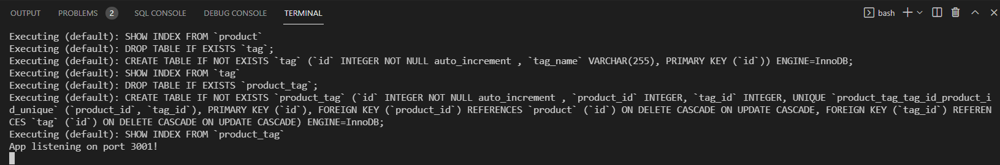
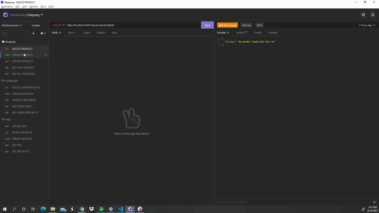

# <README>

## Description

- To give potenial employer's insight to my web developer knowledge
- This project was developed to help the user understand the process of this assignment
- Their prevalence, understanding the fundamental architecture of these platforms will benefit you as a full-stack web developer.

## Table of Contents (Optional)

- [Installation](#installation)

- [Usage](#usage)

- [License](#license)

## Installation
>The first thing you need to do is to go into VScode and create a README project. 

>Then install npm inquirer mySql2 Express sequelize bcrypt

>Then your dependencies will be added package.json, & package-lock.json

## Usage

  
  

## License

 [Apache](http://www.apache.org/licenses/)
---

